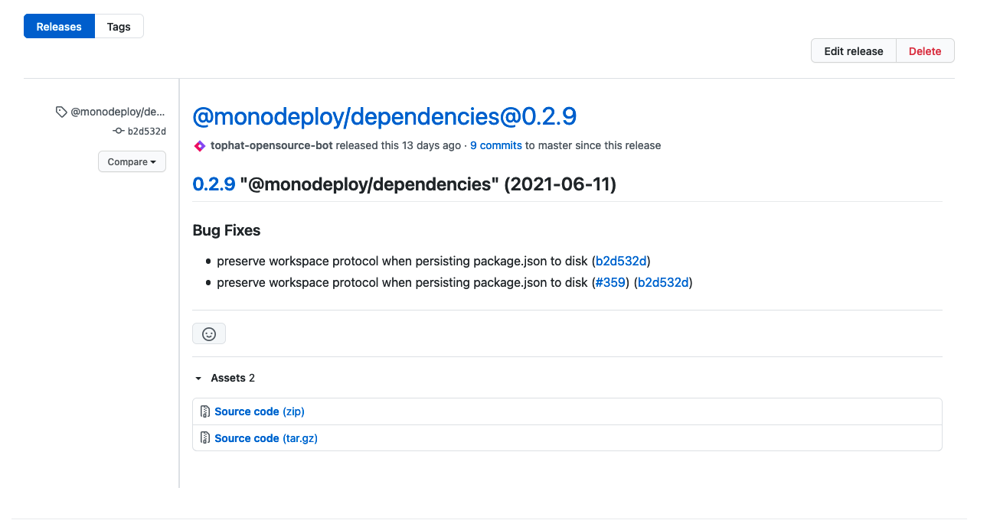
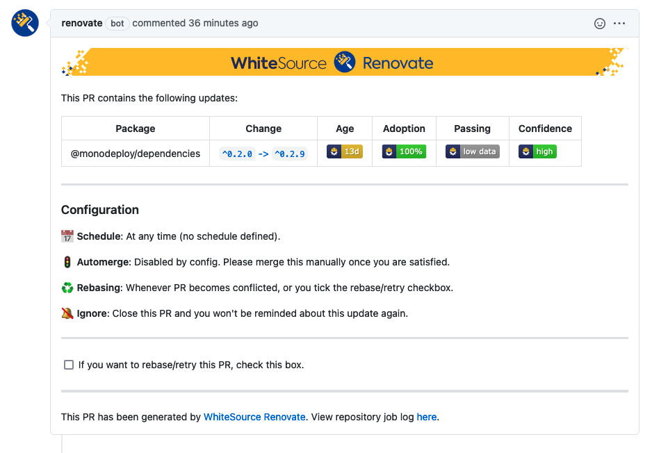

## Purpose

This repo is a minimal repro for this discussion https://github.com/renovatebot/renovate/discussions/10545

## Description of Issue
We're not receiving release notes on our Renovate PRs. We have private monorepos very similar to [monodeploy](https://github.com/tophat/monodeploy), which use the same versioning strategy. Github releases are made each time a package is released and the generated changelog is the body of the release. When we get Renovate PRs, those release notes are not displayed.

## Example
[@monodeploy/dependencies released a new version](https://github.com/tophat/monodeploy/releases/tag/%40monodeploy%2Fdependencies%400.2.9), with the following release: 

Renovate created a [PR to upgrade @monodeploy/dependencies to the latest version](https://github.com/dbasilio/renovate-bug-repro/pull/5) but no release notes were attached to the PR. 

